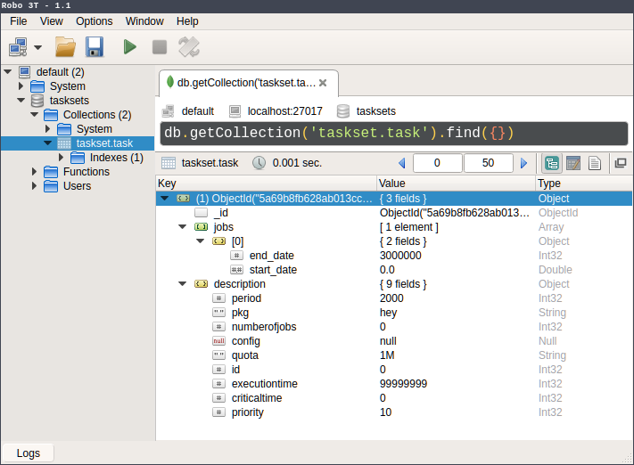

# Monitor

A Monitor is an optional class with callback functions for task-set
events. Following events are supported:


| Function | Description |
| --- | --- |
| `__taskset_event__` | Called, whenever a job of a task is started or stops. The function parameter `taskset` contains the updated task-set. |
| `__taskset_start__` | A task-set processing is started |
| `__taskset_finish__` | A task-set processing is finished | 
| `__taskset_stop__` | A task-set is canceled due to an error or is stopped regularly |

Following monitor classes exist:


| Monitor Class | Description |
| --- | --- |
| `monitors.AbstractMonitor` | This might be the starting point for your own monitor. |
| `monitors.stdio.StdioMonitor` | Simple debugging monitor, which prints information to stdout. |
| `monitors.mongo.MongoMonitor` | Stores description and job data to a mongo database |


```python
from taskgen.distributor import Distributor
from taskgen.monitors.mongo import MongoMonitor

distributor = Distributor("172.25.1.2")

# create monitor
monitor= MongoMonitor()

# handle over it
distributor.monitor = monitor

```


## MongoMonitor

Currently only the mongo database is supported. MongoDB is not a SQL database,
which has serveral advantages in our use case. The integration with
the task-set is seemless due to the fact that the type `dict`, which is the
subtype of tasks and task-sets, is used by mongodb. So there is no need for a
translation layer or an additional Qeury-Language.


