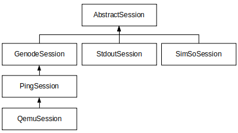

# Sessions

The low level communication between the `Distributor` and a target system is
done by a Session class.




| Session Class | Description |
| --- | --- |
| `session.AbstractSession` | Abstract class for a session. Use this for implementing new sessions |
| `sessions.genode.GenodeSession` | Basic communication with `genode-Taskloader`. |
| `sessions.genode.QemuSession` | Kills a local qemu session, if there is a network timeout. For more information read [Qemu.md](qemu.md) |
| `sessions.genode.PingSession` | Extends the `GenodeSession` by a ping check before a connection is established |
| `sessions.stdio.StdIOSession` | Prints task-sets to stdout instead of sending it |
| `sessions.simso.SimSoSession` | Runs the task-set in a local simulation. Makes use of the SimSo Simulation Framework |

## SimSoSession

The local simulation of a task-set is realized by the
[SimSo](https://github.com/MaximeCheramy/simso) framework and use the default
session interface:

```
./taskgen-cli run -d -t example.Hey0TaskSet -s simso.SimSoSession 172.25.1.1
```

Please notice, the `IP` address is not used, but it identifies the actual
SimSo-session in log files. So it is not recommented to combinate `SimSoSession`
with a range of IP-adresses.

## QemuSession

Sometimes a genonde instanse freezes and does not respond to connection
establishments. The only way to solve this problem is killing the qemu instance
and restarting the operating system. The `qemu-up.sh` script and
`taskgen.sessions.geenode.QemuSession` are a solution to automatically do this
job. [Further reading](qemu.md)


## Implementation

A Session needs to inherit from `session.AbstractSession` and implement the
static method `is_available` and abstract methods `start`, `stop`, `run`,
`close`,`is_running`. `is_available` is called before the class is initialized and checks if
the host is available. For example `PingSession` implements this method and does
a simple ping test.

The method `run` is a special function. It is called multiple times during
processing of a task-set. Whenever new information about a task, like a finished
job, is received, the data will be stored to the taskset during this method
call. With help of a monitor or after the the distributor stopped, it is
possible to access these data.
