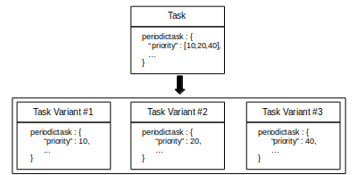

# Tasks

`Task` is subclass of Python's `dict` and therefore behaves the same way. All
attributes of a task are accessed and altered with dictionary methods. 

```Python
from taskgen.task import Task

task = Task()
task['priority'] = 128
task['id'] = 0

# or

task_dict = {
    'priority' : 128,
    'id' : 0
}

task = Task(task_dict)
```

It is possible to build a `Task` from multiple dictionary objects. This concept
is named task blocks and described in [Task-Blocks](./blocks.md).

## Variants

Every attribute in the Task can be a single value or of type `Iterable`. It is
possible to define ranges `range(0,10)`, lists `[0,1,2,3]` or custom
[generators](https://wiki.python.org/moin/Generators). Due to this fact, an attribute
might have multiple variants of a value. Multiple options for an attribute results in
multiple variants of a task and finally multiple variants of a taskset. 




For example, if you want to analyse, how a scheduler reacts to different values
of a specific attribute, you will define its value as an `Iterable` and generate all
task-set variants. Each generated task-set differs from one another in this
attribute.

The method `variants()` returns a generator. You can use this generator in a
`for` loop or call its `next()` method. Calling this method will generate a new
variant of a task-set and return a `TaskSet` until all variants are exhausted.


```Python
from taskgen.task import Task

task = Task()
task['id] = range(0,128)
task['priority'] = 42

# generates 128 variants of the task
for variant in task.variants(): 
    print(variant)
    
taskset = Taskset()
taskset.append(task)

# generate 128 variants of task-sets
# Each task-set has one variant of the task.
for variant in taskset.variants():
    print(variant)
```


## Attributes

Following attributes are part of every task. 

### General

| Key | Type | Description |
| --- | --- | --- |
| `id` | Integer | Every task is identifed by an unique ID. if the task is appended to a `TaskSet`, this value will be set automatically. |
| `criticaltime` | Integer | Life time of a task. The task is killed by passing this time. The value `0` sets life time to infinite. *Unit: milliseconds* |
| `executiontime` | Integer | This attribute has no purpose but it is necessary to provide a value. Default value: `999999999` *Unit: milliseconds* |

### Binary

| Key | Type | Description |
| --- | --- | --- |
| `quota` | String | Ram usage of the binary. Example: `1M` |
| `pkg` | String | Name of the binary located in `taskgen/src` |
| `config` | `dict` | A dictionary structure which will be handed over to a job of the task. |

### Frequency

| Key | Type | Description |
| --- | --- | --- |
| `period` | Integer | Time between one and the next execution of a job. The value `0` lead to a single job executions. Every other value will forces an endless execution every `period` seconds. *Unit: milliseconds* |

### Schedulability

| Key | Type | Description |
| --- | --- | --- |
| `priority` | Integer | The priority of the task. Possible values: `0 - 128`. This attribute sets the scheduler algorithm to **fixed priority**. |
| `deadline` | Integer | Deadline until the job should be terminated. If the job lasts longer, the job is **not** terminated. This attribute chooses **earliest deadline first** scheduling and the `priority` attribute is ignored by `genode-Taskloader`. *Unit: milliseconds*. |

